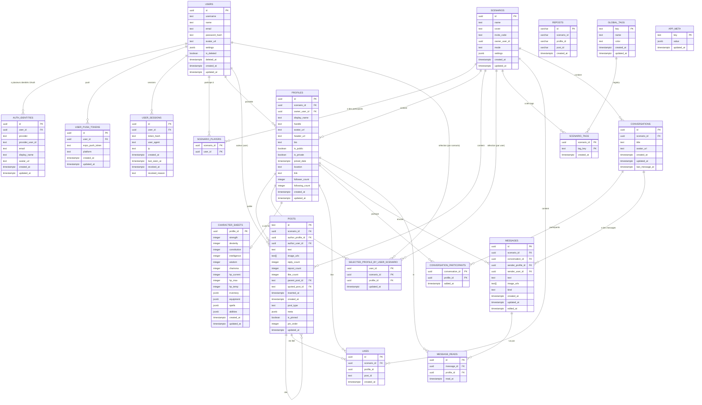

# Base de données Feedverse

**Mise à jour :** 20-01-2026

[](#)

## Bonnes pratiques

- Les tables sont au pluriel et en minuscule (exemple : `users`)
- Nommage SQL en `snake_case` (ex: `owner_user_id`, `inserted_at`)
- Les champs de référence se terminent par `_id` (ex: `scenario_id`, `profile_id`)
- La plupart des tables utilisent des UUID comme clés primaires
- Certaines tables historiques utilisent des IDs texte (ex: `posts.id` en `text`, `reposts.*` en `varchar`) : traiter ces IDs comme opaques
- Contraintes de clés étrangères avec CASCADE pour maintenir l'intégrité
- Tous les timestamps incluent la timezone (TIMESTAMP WITH TIME ZONE)
- Utilisation de JSONB pour les données structurées variables
- Index optimisés pour les requêtes fréquentes
- Convention de nommage cohérente pour tous les objets
- Architecture multi-scénarios supportée nativement
- Gestion des handles unique par scénario pour éviter les conflits

## Configuration PostgreSQL requise

### Extensions nécessaires

```sql
-- Extension UUID pour génération d'identifiants
CREATE EXTENSION IF NOT EXISTS "pgcrypto";

-- Extension pour expressions régulières avancées (si nécessaire pour recherche)
CREATE EXTENSION IF NOT EXISTS "pg_trgm";
```

## Architecture multi-scénarios

L'architecture permet à un utilisateur de créer et gérer plusieurs scénarios narratifs. Chaque scénario est un univers indépendant avec ses propres profils et posts. La séparation entre `users` (compte utilisateur) et `profiles` (personnages dans les scénarios) garantit une flexibilité maximale pour la création narrative.

### Relation utilisateur-scénario

- **1 utilisateur → N scénarios** (création et participation)
- **1 scénario → N profils** (personnages dans l'univers)
- **1 utilisateur → N profils par scénario** (incarnation de plusieurs personnages)

## Tables principales

### Table `users`

**Description :** Représente les comptes utilisateurs de la plateforme Feedverse. Cette table stocke les informations personnelles et d'authentification. Les utilisateurs peuvent créer des scénarios et incarner plusieurs profils narratifs dans chaque scénario.

```sql
CREATE TABLE IF NOT EXISTS users (
  id            uuid PRIMARY KEY DEFAULT gen_random_uuid(),
  username      text NOT NULL,
  name          text,
  email         text,
  password_hash text,
  avatar_url    text NOT NULL,
  settings      jsonb NOT NULL DEFAULT '{}'::jsonb,
  deleted_at    timestamptz,
  is_deleted    boolean NOT NULL DEFAULT false,
  created_at    timestamptz NOT NULL DEFAULT now(),
  updated_at    timestamptz
);

-- Index pour les performances
CREATE UNIQUE INDEX IF NOT EXISTS users_username_uidx ON users (lower(username));
CREATE UNIQUE INDEX IF NOT EXISTS users_email_uidx ON users (lower(email)) WHERE email IS NOT NULL;
CREATE INDEX IF NOT EXISTS users_deleted_idx ON users (is_deleted, deleted_at);
```

**Explications des colonnes :**

- `id` : Identifiant unique UUID généré automatiquement
- `username` : Nom d'utilisateur unique (insensible à la casse)
- `name` : Nom d'affichage public de l'utilisateur
- `email` : Adresse email, nullable car certains providers OAuth peuvent masquer l'email
- `password_hash` : Hash bcrypt du mot de passe, nullable pour les comptes OAuth uniquement
- `avatar_url` : URL de l'image de profil de l'utilisateur
- `settings` : Configuration personnalisée de l'utilisateur au format JSONB (darkMode, showTimestamps)
- `deleted_at` : Timestamp de suppression (soft-delete)
- `is_deleted` : Flag de suppression (soft-delete)
- `created_at` : Timestamp de création du compte
- `updated_at` : Timestamp de dernière modification

**Structure du champ `settings` (JSONB) :**

```json
{
  "showTimestamps": true,
  "darkMode": "system"
}
```

- `showTimestamps` : Affichage ou non des timestamps dans l'interface
- `darkMode` : Mode d'affichage (`"light"`, `"dark"`, `"system"`)

### Table `auth_identities`

**Description :** Stocke les identités OAuth multiples associées à un compte utilisateur. Permet la connexion via plusieurs providers (Google, Apple, GitHub) pour un même utilisateur.

```sql
CREATE TABLE IF NOT EXISTS auth_identities (
  id               uuid PRIMARY KEY DEFAULT gen_random_uuid(),
  user_id          uuid NOT NULL REFERENCES users(id) ON DELETE CASCADE,
  provider         text NOT NULL,
  provider_user_id text NOT NULL,
  email            text,
  display_name     text,
  avatar_url       text,
  created_at       timestamptz NOT NULL DEFAULT now(),
  updated_at       timestamptz
);

-- Index pour les performances
CREATE UNIQUE INDEX IF NOT EXISTS auth_identities_provider_uidx ON auth_identities (provider, provider_user_id);
CREATE INDEX IF NOT EXISTS auth_identities_user_idx ON auth_identities (user_id);
CREATE UNIQUE INDEX IF NOT EXISTS auth_identities_user_provider_uidx ON auth_identities (user_id, provider);
```

**Explications des colonnes :**

- `id` : Identifiant unique UUID de l'identité OAuth
- `user_id` : Référence vers le compte utilisateur parent
- `provider` : Nom du provider OAuth (google, apple, github, etc.)
- `provider_user_id` : Identifiant unique fourni par le provider (OIDC "sub")
- `email` : Email retourné par le provider si disponible
- `display_name` : Nom d'affichage retourné par le provider
- `avatar_url` : URL de l'avatar fournie par le provider
- `created_at` : Timestamp de création de l'identité
- `updated_at` : Timestamp de dernière modification

### Table `user_sessions`

**Description :** Sessions actives (et révoquées) par utilisateur. Le backend y stocke un hash du token (ex: SHA-256) afin de pouvoir invalider un device sans stocker le JWT brut.

```sql
CREATE TABLE IF NOT EXISTS user_sessions (
  id             uuid PRIMARY KEY DEFAULT gen_random_uuid(),
  user_id         uuid NOT NULL REFERENCES users(id) ON DELETE CASCADE,
  token_hash      text NOT NULL UNIQUE,
  user_agent      text,
  ip              text,
  created_at      timestamptz NOT NULL DEFAULT now(),
  last_seen_at    timestamptz NOT NULL DEFAULT now(),
  revoked_at      timestamptz,
  revoked_reason  text
);

CREATE INDEX IF NOT EXISTS idx_user_sessions_user_active
  ON user_sessions (user_id) WHERE revoked_at IS NULL;

CREATE INDEX IF NOT EXISTS idx_user_sessions_user_last_seen
  ON user_sessions (user_id, last_seen_at DESC, id DESC);
```

**Notes :**

- `token_hash` est unique (1 row par token).
- La session “active” est une row avec `revoked_at IS NULL`.

### Table `user_push_tokens`

**Description :** Tokens push Expo / device tokens associés à un utilisateur.

```sql
CREATE TABLE IF NOT EXISTS user_push_tokens (
  id             uuid PRIMARY KEY DEFAULT gen_random_uuid(),
  user_id         uuid NOT NULL REFERENCES users(id) ON DELETE CASCADE,
  expo_push_token text NOT NULL,
  platform        text,
  created_at      timestamptz NOT NULL DEFAULT now(),
  updated_at      timestamptz NOT NULL DEFAULT now(),
  UNIQUE (user_id, expo_push_token)
);

CREATE INDEX IF NOT EXISTS idx_user_push_tokens_user
  ON user_push_tokens (user_id);
```

### Table `scenarios`

**Description :** Représente les univers narratifs créés par les utilisateurs. Chaque scénario est un espace indépendant où se déroulent des histoires, fanfictions ou campagnes de jeu de rôle.

```sql
CREATE TABLE IF NOT EXISTS scenarios (
  id          uuid PRIMARY KEY DEFAULT gen_random_uuid(),
  name        text NOT NULL,
  cover       text NOT NULL,
  invite_code text NOT NULL,
  owner_user_id uuid NOT NULL REFERENCES users(id) ON DELETE RESTRICT,
  description text,
  mode        text NOT NULL DEFAULT 'story', -- story | campaign
  gm_user_ids uuid[] NOT NULL DEFAULT '{}'::uuid[],
  settings    jsonb NOT NULL DEFAULT '{}'::jsonb,
  created_at  timestamptz NOT NULL DEFAULT now(),
  updated_at  timestamptz
);

-- Indices
CREATE UNIQUE INDEX IF NOT EXISTS scenarios_invite_code_uidx ON scenarios (upper(invite_code));
CREATE INDEX IF NOT EXISTS scenarios_owner_idx ON scenarios (owner_user_id);
CREATE INDEX IF NOT EXISTS scenarios_mode_idx ON scenarios (mode);
```

**Explications des colonnes :**

- `id` : Identifiant unique UUID du scénario
- `name` : Nom du scénario (exemple : "K-Pop Universe", "Fantasy Campaign")
- `cover` : URL de l'image de couverture du scénario
- `invite_code` : Code d'invitation pour rejoindre un scénario (unique)
- `owner_user_id` : Utilisateur owner du scénario (utile pour transfert de propriété)
- `description` : Description libre
- `mode` : Mode du scénario (`story` ou `campaign`)
- `gm_user_ids` : Liste d'utilisateurs avec rôle MJ (le créateur est généralement inclus)
- `settings` : JSONB extensible (ex: limites de profils, pins, etc.)
- `created_at` : Timestamp de création du scénario
- `updated_at` : Timestamp de dernière modification

**Exemples de `settings` (JSONB) :**

```json
{
  "profileLimitMode": "per_owner",
  "pinnedPostIds": ["po_123", "po_456"]
}
```

### Table `scenario_players`

**Description :** Table de liaison many-to-many entre les scénarios et les utilisateurs. Définit quels utilisateurs ont accès à un scénario donné (créateur et participants invités).

```sql
CREATE TABLE IF NOT EXISTS scenario_players (
  scenario_id uuid NOT NULL REFERENCES scenarios(id) ON DELETE CASCADE,
  user_id     uuid NOT NULL REFERENCES users(id) ON DELETE CASCADE,
  PRIMARY KEY (scenario_id, user_id)
);

-- Index pour les performances
CREATE INDEX IF NOT EXISTS scenario_players_scenario_idx ON scenario_players (scenario_id);
CREATE INDEX IF NOT EXISTS scenario_players_user_idx ON scenario_players (user_id);
```

**Explications des colonnes :**

- `scenario_id` : Référence vers le scénario
- `user_id` : Référence vers l'utilisateur participant

**Cas d'usage :**

- Lister tous les participants d'un scénario
- Lister tous les scénarios auxquels un utilisateur a accès
- Contrôler les permissions d'accès aux contenus d'un scénario

### Table `profiles`

**Description :** Représente les profils de personnages créés par les utilisateurs dans chaque scénario. Un utilisateur peut incarner plusieurs personnages dans un même univers narratif. Ces profils sont l'identité narrative utilisée pour publier des posts.

```sql
CREATE TABLE IF NOT EXISTS profiles (
  id              uuid PRIMARY KEY DEFAULT gen_random_uuid(),
  scenario_id     uuid NOT NULL REFERENCES scenarios(id) ON DELETE CASCADE,
  owner_user_id   uuid NOT NULL REFERENCES users(id) ON DELETE CASCADE,
  display_name    text NOT NULL,
  handle          text NOT NULL,
  avatar_url      text NOT NULL,
  header_url      text,
  bio             text,
  is_public       boolean NOT NULL DEFAULT false,
  is_private      boolean NOT NULL DEFAULT false,
  joined_date     timestamptz,
  location        text,
  link            text,
  follower_count  integer NOT NULL DEFAULT 0,
  following_count integer NOT NULL DEFAULT 0,
  created_at      timestamptz NOT NULL DEFAULT now(),
  updated_at      timestamptz
);

-- Index pour les performances
CREATE UNIQUE INDEX IF NOT EXISTS profiles_scenario_handle_uidx ON profiles (scenario_id, lower(handle));
CREATE INDEX IF NOT EXISTS profiles_scenario_idx ON profiles (scenario_id);
CREATE INDEX IF NOT EXISTS profiles_owner_idx ON profiles (owner_user_id);
```

**Explications des colonnes :**

- `id` : Identifiant unique UUID du profil
- `scenario_id` : Référence vers le scénario auquel appartient ce profil
- `owner_user_id` : Référence vers l'utilisateur qui contrôle ce personnage
- `display_name` : Nom d'affichage du personnage (exemple : "Hyunjin")
- `handle` : Identifiant unique du profil dans le scénario (exemple : "jiniret" pour @jiniret)
- `avatar_url` : URL de l'image de profil du personnage
- `header_url` : URL de l'image de bannière du profil
- `bio` : Description ou biographie du personnage
- `is_public` : Indique si le profil est public dans le scénario
- `is_private` : Indique si le profil est privé (narrativement)
- `joined_date` : Date narrative d'entrée du personnage dans l'univers
- `location` : Localisation narrative du personnage
- `link` : Lien externe associé au personnage
- `follower_count` : Nombre de followers narratifs (compteur dénormalisé)
- `following_count` : Nombre de comptes suivis narratifs (compteur dénormalisé)
- `created_at` : Timestamp de création du profil
- `updated_at` : Timestamp de dernière modification

**Contraintes :**

- Le `handle` doit être unique par scénario (insensible à la casse)
- Un utilisateur peut créer plusieurs profils dans un même scénario

### Table `posts`

**Description :** Représente les publications narratives créées par les profils dans les scénarios. Les posts peuvent être des messages simples, des réponses (replies) ou des citations (quotes). Ils forment le fil narratif de l'histoire.

```sql
CREATE TABLE IF NOT EXISTS posts (
  id                text PRIMARY KEY DEFAULT gen_random_uuid(),
  scenario_id        uuid NOT NULL REFERENCES scenarios(id) ON DELETE CASCADE,
  author_profile_id  uuid NOT NULL REFERENCES profiles(id) ON DELETE CASCADE,
  author_user_id     uuid REFERENCES users(id) ON DELETE RESTRICT,
  text              text NOT NULL,
  image_urls         text[],
  reply_count        integer NOT NULL DEFAULT 0,
  repost_count       integer NOT NULL DEFAULT 0,
  like_count         integer NOT NULL DEFAULT 0,
  parent_post_id     text REFERENCES posts(id) ON DELETE SET NULL,
  quoted_post_id     text REFERENCES posts(id) ON DELETE SET NULL,
  inserted_at        timestamptz NOT NULL DEFAULT now(),
  created_at         timestamptz NOT NULL DEFAULT now(),
  post_type          text NOT NULL DEFAULT 'rp', -- rp|roll|log|quest|combat|gm
  meta               jsonb,
  is_pinned          boolean NOT NULL DEFAULT false,
  pin_order          integer,
  updated_at         timestamptz
);

-- Index pour les performances
CREATE INDEX IF NOT EXISTS posts_scenario_created_idx ON posts (scenario_id, created_at DESC);
CREATE INDEX IF NOT EXISTS posts_scenario_inserted_idx ON posts (scenario_id, inserted_at DESC, id DESC);
CREATE INDEX IF NOT EXISTS posts_author_created_idx ON posts (author_profile_id, created_at DESC);
CREATE INDEX IF NOT EXISTS idx_posts_author_user_id_created_at ON posts (author_user_id, created_at DESC, id DESC);
CREATE INDEX IF NOT EXISTS posts_parent_idx ON posts (parent_post_id);
CREATE INDEX IF NOT EXISTS posts_quoted_idx ON posts (quoted_post_id);
CREATE INDEX IF NOT EXISTS posts_post_type_idx ON posts (scenario_id, post_type);
CREATE INDEX IF NOT EXISTS posts_pins_idx ON posts (scenario_id, is_pinned, pin_order) WHERE is_pinned = true;
CREATE UNIQUE INDEX IF NOT EXISTS posts_scenario_id_id_uidx ON posts (scenario_id, id);
```

**Explications des colonnes :**

- `id` : Identifiant unique du post (stocké en `text`). Par défaut, il est généré via `gen_random_uuid()` (UUID sérialisé en texte)
- `scenario_id` : Référence vers le scénario dans lequel le post est publié
- `author_profile_id` : Référence vers le profil auteur du post
- `author_user_id` : Référence vers l'utilisateur auteur (utile pour sécurité/modération/analytics). Peut être NULL pour données legacy
- `text` : Contenu textuel du post (dialogue, narration, description)
- `image_urls` : Tableau d'URLs des images attachées au post
- `reply_count` : Nombre de réponses au post (compteur dénormalisé)
- `repost_count` : Nombre de reposts (compteur dénormalisé)
- `like_count` : Nombre de likes (compteur dénormalisé)
- `parent_post_id` : Référence vers le post parent si c'est une réponse (reply)
- `quoted_post_id` : Référence vers le post cité si c'est une citation (quote)
- `inserted_at` : Timestamp d'insertion, utilisé pour pagination stable (cursor).
- `created_at` : Timestamp narratif du post (peut être modifié pour retcon)
- `post_type` : Type de post (RP / Roll / Log / Quest / Combat / GM)
- `meta` : JSONB libre (payload de roll, état de quest/combat, etc.)
- `is_pinned`, `pin_order` : Champs d'épinglage (campagne)
- `updated_at` : Timestamp de dernière modification du post

**Types de posts :**

- **Post simple** : `parent_post_id` et `quoted_post_id` sont NULL
- **Reply** : `parent_post_id` est défini, c'est une réponse à un autre post
- **Quote** : `quoted_post_id` est défini, le post cite un autre post

**Comportements :**

- La suppression d'un post met `parent_post_id` et `quoted_post_id` à NULL (ON DELETE SET NULL)
- Les compteurs sont dénormalisés pour optimiser les performances
- Le `created_at` est modifiable pour permettre des retcons narratifs

### Table `repost`

```sql
CREATE TABLE IF NOT EXISTS reposts (
  id         varchar PRIMARY KEY,
  scenario_id varchar NOT NULL,
  profile_id  varchar NOT NULL,
  post_id     varchar NOT NULL,
  created_at  timestamptz NOT NULL
);

-- Index pour les performances
-- Un repost par (profile, post)
CREATE UNIQUE INDEX IF NOT EXISTS reposts_profile_post_uidx ON reposts (profile_id, post_id);
```

**Explications des colonnes :**

- `id` : Identifiant unique du repost (stocké en texte).
- `scenario_id`, `profile_id`, `post_id` : IDs texte (table legacy).
- `created_at` : Timestamp de création du repost.

**Note :** dans la base actuelle, `reposts` ne possède pas de clés étrangères ; l’intégrité est donc applicative/legacy.


### Table `likes`

**Description :** Stocke les likes (relation many-to-many) entre un profil et un post. Permet l’historique, les requêtes fiables, et la maintenance du compteur dénormalisé `posts.like_count`.

```sql
CREATE TABLE IF NOT EXISTS likes (
  scenario_id uuid NOT NULL REFERENCES scenarios(id) ON DELETE CASCADE,
  profile_id  uuid NOT NULL,
  post_id     text NOT NULL,
  created_at  timestamptz NOT NULL DEFAULT now(),
  id          uuid PRIMARY KEY DEFAULT gen_random_uuid(),
  UNIQUE (scenario_id, profile_id, post_id),
  FOREIGN KEY (scenario_id, profile_id) REFERENCES profiles(scenario_id, id) ON DELETE CASCADE,
  FOREIGN KEY (scenario_id, post_id) REFERENCES posts(scenario_id, id) ON DELETE CASCADE
);

-- Index pour les performances
CREATE INDEX IF NOT EXISTS likes_scenario_idx ON likes (scenario_id);
CREATE INDEX IF NOT EXISTS likes_profile_idx ON likes (profile_id, created_at DESC);
CREATE INDEX IF NOT EXISTS likes_post_idx ON likes (post_id, created_at DESC);

-- Note: la base contient aussi des index redondants (ex: idx_likes_profile/idx_likes_post/idx_likes_scenario_created_at)
```

**Explications des colonnes :**

- `scenario_id` : Référence vers le scénario (filtrage, contrôle, perf)
- `profile_id` : Profil ayant liké
- `post_id` : Post liké
- `created_at` : Timestamp de création du like
- `id` : Identifiant unique UUID du like

**Contraintes :**

- 1 like max par (scenario_id, profile_id, post_id) via la contrainte UNIQUE.

---

## Messagerie (DM)

La messagerie est **scénario-scopée** et s’appuie sur une séparation claire :

- `conversations` : le “thread” (groupe ou DM)
- `conversation_participants` : les profils participants (normalisé)
- `messages` : les messages du thread

> Note : dans l’app mobile, `Conversation.participantProfileIds: string[]` est stocké côté Postgres via la table `conversation_participants` (plutôt qu’un `uuid[]`) pour garder l’intégrité référentielle et des index efficaces.

### Table `conversations`

**Description :** Représente un fil de conversation (DM 1:1 ou groupe) dans un scénario.

```sql
CREATE TABLE IF NOT EXISTS conversations (
  id              uuid PRIMARY KEY DEFAULT gen_random_uuid(),
  scenario_id      uuid NOT NULL REFERENCES scenarios(id) ON DELETE CASCADE,

  title           text,
  avatar_url      text,

  created_at      timestamptz NOT NULL DEFAULT now(),
  updated_at      timestamptz,
  last_message_at timestamptz
);

-- Index (liste inbox / tri)
CREATE INDEX IF NOT EXISTS conversations_scenario_last_message_idx
  ON conversations (scenario_id, last_message_at DESC NULLS LAST);
```

**Explications des colonnes :**

- `scenario_id` : partition logique multi-scénarios
- `title`, `avatar_url` : utiles pour les conversations de groupe (optionnel)
- `last_message_at` : permet d’ordonner l’inbox sans jointures coûteuses

### Table `conversation_participants`

**Description :** Participants d’une conversation, référencés par `profile_id`.

```sql
CREATE TABLE IF NOT EXISTS conversation_participants (
  conversation_id uuid NOT NULL REFERENCES conversations(id) ON DELETE CASCADE,
  profile_id      uuid NOT NULL REFERENCES profiles(id) ON DELETE CASCADE,
  added_at        timestamptz NOT NULL DEFAULT now(),
  PRIMARY KEY (conversation_id, profile_id)
);

-- Index (lister les conversations d’un profil)
CREATE INDEX IF NOT EXISTS conversation_participants_profile_idx
  ON conversation_participants (profile_id, conversation_id);
```

**Contraintes :**

- PK composite : garantit 1 participation max par (conversation, profil)
- `ON DELETE CASCADE` : si une conversation ou un profil est supprimé, on nettoie automatiquement

### Table `messages`

**Description :** Messages d’une conversation, envoyés par un `sender_profile_id`.

```sql
CREATE TABLE IF NOT EXISTS messages (
  id                uuid PRIMARY KEY DEFAULT gen_random_uuid(),
  scenario_id        uuid NOT NULL REFERENCES scenarios(id) ON DELETE CASCADE,
  conversation_id    uuid NOT NULL REFERENCES conversations(id) ON DELETE CASCADE,
  sender_profile_id  uuid NOT NULL REFERENCES profiles(id) ON DELETE RESTRICT,
  sender_user_id     uuid REFERENCES users(id) ON DELETE RESTRICT,

  text              text NOT NULL,

  image_urls         text[] NOT NULL DEFAULT '{}'::text[],
  kind               text NOT NULL DEFAULT 'text',

  created_at        timestamptz NOT NULL DEFAULT now(),
  updated_at        timestamptz,
  edited_at         timestamptz
);

-- Index (charger un thread)
CREATE INDEX IF NOT EXISTS idx_messages_conversation_created_at
  ON messages (conversation_id, created_at);

-- Index (debug/analytics par scénario)
CREATE INDEX IF NOT EXISTS idx_messages_scenario_created_at
  ON messages (scenario_id, created_at);

CREATE INDEX IF NOT EXISTS idx_messages_sender_user_id_created_at
  ON messages (sender_user_id, created_at);
```

**Explications des colonnes :**

- `scenario_id` : facilite filtrage/perf et garantit l’isolation
- `sender_profile_id` : profil “in character” qui parle
- `sender_user_id` : utilisateur réel (utile pour sécurité/modération/analytics)
- `image_urls` : pièces jointes image (0..n)
- `kind` : type de message (ex: `text`). Valeur libre côté DB, mais doit être interprétée côté app
- `edited_at` : timestamp d’édition (différent de `updated_at` qui peut être utilisé techniquement)

### Table `message_reads`

**Description :** Marqueur de lecture d’un message par profil. Permet de calculer les “unreads” de façon fiable.

```sql
CREATE TABLE IF NOT EXISTS message_reads (
  id         uuid PRIMARY KEY DEFAULT gen_random_uuid(),
  message_id uuid NOT NULL REFERENCES messages(id) ON DELETE CASCADE,
  profile_id uuid NOT NULL REFERENCES profiles(id) ON DELETE CASCADE,
  read_at    timestamptz NOT NULL DEFAULT now(),
  UNIQUE (message_id, profile_id)
);

CREATE INDEX IF NOT EXISTS idx_message_reads_message ON message_reads (message_id);
CREATE INDEX IF NOT EXISTS idx_message_reads_profile ON message_reads (profile_id);
```

### Trigger : mise à jour automatique de `last_message_at`

**Objectif :** garder `conversations.last_message_at` synchronisé à chaque insertion de message (tri inbox performant).

```sql
CREATE OR REPLACE FUNCTION touch_conversation_last_message() RETURNS trigger AS $$
BEGIN
  UPDATE conversations
  SET last_message_at = NEW.created_at,
      updated_at = now()
  WHERE id = NEW.conversation_id;
  RETURN NEW;
END;
$$ LANGUAGE plpgsql;

CREATE TRIGGER trg_messages_touch_conversation_last_message
AFTER INSERT ON messages
FOR EACH ROW
EXECUTE FUNCTION touch_conversation_last_message();
```

**Remarque :** pour un script idempotent (migrations), utilisez `DROP TRIGGER ...` de manière conditionnelle avant de re-créer le trigger.

### Table `selected_profile_by_user_scenario`

**Description :** Stocke le profil actuellement sélectionné **par utilisateur** et **par scénario**. Détermine quel personnage est actif lors de la navigation et de la création de posts.

> Note : en local (DB v5), `selectedProfileByScenario` n'est pas encore multi-user. Côté backend, il faut absolument stocker la sélection par utilisateur.

```sql
CREATE TABLE IF NOT EXISTS selected_profile_by_user_scenario (
  user_id       uuid NOT NULL REFERENCES users(id) ON DELETE CASCADE,
  scenario_id   uuid NOT NULL REFERENCES scenarios(id) ON DELETE CASCADE,
  profile_id    uuid NOT NULL REFERENCES profiles(id) ON DELETE CASCADE,
  updated_at    timestamptz NOT NULL DEFAULT now()
);

ALTER TABLE selected_profile_by_user_scenario
  ADD CONSTRAINT selected_profile_by_user_scenario_pk
  PRIMARY KEY (user_id, scenario_id);

CREATE INDEX IF NOT EXISTS selected_profile_by_user_scenario_profile_idx
  ON selected_profile_by_user_scenario (profile_id);
```

**Explications des colonnes :**

- `user_id` : Référence vers l'utilisateur
- `scenario_id` : Référence vers le scénario
- `profile_id` : Référence vers le profil sélectionné
- `updated_at` : Timestamp de dernière sélection

**Cas d'usage :**

- Déterminer quel profil utiliser pour publier un nouveau post
- Mémoriser le dernier personnage incarné dans chaque scénario
- Faciliter la navigation entre personnages

### Table `app_meta`

**Description :** Table de métadonnées applicatives pour stocker des informations système comme la version de la base de données, les configurations globales ou les états de migration.

```sql
CREATE TABLE IF NOT EXISTS app_meta (
  key        text PRIMARY KEY,
  value      jsonb NOT NULL,
  updated_at timestamptz NOT NULL DEFAULT now()
);
```

**Explications des colonnes :**

- `key` : Clé unique identifiant la métadonnée
- `value` : Valeur au format JSONB pour une flexibilité maximale
- `updated_at` : Timestamp de dernière mise à jour

**Exemples d'utilisation :**

- `db_version` : Version du schéma de base de données
- `seeded_at` : Timestamp du dernier seed de données
- `feature_flags` : Configuration des fonctionnalités activées

---

## Tags (campagne / organisation)

Les tags sont stockés sous forme d'un **registry global** et d'une **liaison par scénario**.

### Table `global_tags`

```sql
CREATE TABLE IF NOT EXISTS global_tags (
  key        text PRIMARY KEY,
  name       text NOT NULL,
  color      text NOT NULL,
  created_at timestamptz NOT NULL DEFAULT now(),
  updated_at timestamptz
);
```

### Table `scenario_tags`

```sql
CREATE TABLE IF NOT EXISTS scenario_tags (
  scenario_id uuid NOT NULL REFERENCES scenarios(id) ON DELETE CASCADE,
  tag_key     text NOT NULL REFERENCES global_tags(key) ON DELETE RESTRICT,
  created_at  timestamptz NOT NULL DEFAULT now(),
  PRIMARY KEY (scenario_id, tag_key)
);

CREATE INDEX IF NOT EXISTS scenario_tags_tag_idx ON scenario_tags (tag_key);
```

---

## Feuilles de personnage (campagne)

### Table `character_sheets`

Objectif : refléter la `CharacterSheet` de l'app (stats fixes + inventaire/équipement/sorts/capacités en JSONB).

```sql
CREATE TABLE IF NOT EXISTS character_sheets (
  profile_id     uuid PRIMARY KEY REFERENCES profiles(id) ON DELETE CASCADE,

  -- identity
  name           text,
  race           text,
  class          text,
  level          integer,
  alignment      text,
  background     text,

  -- stats
  strength       integer NOT NULL DEFAULT 10,
  dexterity      integer NOT NULL DEFAULT 10,
  constitution   integer NOT NULL DEFAULT 10,
  intelligence   integer NOT NULL DEFAULT 10,
  wisdom         integer NOT NULL DEFAULT 10,
  charisma       integer NOT NULL DEFAULT 10,

  -- combat
  hp_current     integer NOT NULL DEFAULT 10,
  hp_max         integer NOT NULL DEFAULT 10,
  hp_temp        integer,
  status         text,

  -- lists
  inventory      jsonb NOT NULL DEFAULT '[]'::jsonb,
  equipment      jsonb NOT NULL DEFAULT '[]'::jsonb,
  spells         jsonb NOT NULL DEFAULT '[]'::jsonb,
  abilities      jsonb NOT NULL DEFAULT '[]'::jsonb,

  -- notes
  public_notes   text,
  private_notes  text,

  created_at     timestamptz NOT NULL DEFAULT now(),
  updated_at     timestamptz
);
```

## Schéma relationnel complet



## Index et optimisations

### Stratégie d'indexation

Les index sont créés pour optimiser les requêtes les plus fréquentes :

1. **Unicité et recherche utilisateurs**
   - `users_username_uidx` : Recherche insensible à la casse sur username
   - `users_email_uidx` : Recherche et unicité email (partiel pour gérer les NULL)

2. **Identités OAuth**
   - `auth_identities_provider_uidx` : Unicité par provider et provider_user_id
   - `auth_identities_user_idx` : Lister les identités d'un utilisateur
   - `auth_identities_user_provider_uidx` : Un seul provider par utilisateur

3. **Relations scénarios**
   - `scenario_players_scenario_idx` : Lister les participants d'un scénario
   - `scenario_players_user_idx` : Lister les scénarios d'un utilisateur

4. **Profils**
   - `profiles_scenario_handle_uidx` : Unicité handle par scénario
   - `profiles_scenario_idx` : Lister les profils d'un scénario
   - `profiles_owner_idx` : Lister les profils d'un utilisateur

5. **Posts et pagination**
   - `posts_scenario_created_idx` : Feed principal du scénario
   - `posts_author_created_idx` : Posts d'un profil spécifique
   - `posts_parent_idx` : Récupération des replies
   - `posts_quoted_idx` : Récupération des citations

6. **Likes**
   - `likes_post_idx` : Lister les likes d’un post / vérifier popularité / debug
   - `likes_profile_idx` : Lister les posts likés par un profil (historique)
  - UNIQUE `(scenario_id, profile_id, post_id)` : Garantit 1 like max par profil et post (par scénario)
  - Note : il existe actuellement des index redondants (`idx_likes_*` et `likes_*_idx`)

7. **Messagerie (DM)**
  - `conversations_scenario_last_message_idx` : inbox triée par activité
  - `conversation_participants_profile_idx` : lister toutes les conversations d’un profil
  - `idx_messages_conversation_created_at` : charger un thread dans l’ordre

### Compteurs dénormalisés

Les champs suivants sont maintenus par des triggers ou des transactions applicatives :

- `profiles.follower_count`
- `profiles.following_count`
- `posts.reply_count`
- `posts.repost_count`
- `posts.like_count`

Cette dénormalisation évite des COUNT coûteux à chaque affichage.

## Contraintes et validations

### Contraintes de clés étrangères

La majorité des relations utilisent `ON DELETE CASCADE` (ex: `scenario_players`, `profiles`, `conversation_participants`) pour maintenir l'intégrité.

Exceptions importantes dans la base actuelle :

- `scenarios.owner_user_id` : `ON DELETE RESTRICT`
- `posts.author_user_id` : `ON DELETE RESTRICT`
- `messages.sender_profile_id` / `messages.sender_user_id` : `ON DELETE RESTRICT`
- Relations `posts.parent_post_id` / `posts.quoted_post_id` : `ON DELETE SET NULL`
- `reposts` : pas de clés étrangères (table legacy)

### Règles métier

1. **Handles uniques par scénario** : Un handle ne peut être utilisé qu'une seule fois dans un scénario donné
2. **Un provider OAuth par utilisateur** : Un utilisateur ne peut lier qu'un seul compte par provider
3. **Timestamps timezone** : Tous les timestamps incluent la timezone pour une gestion internationale
4. **IDs** : la plupart des tables utilisent des UUID, mais certaines utilisent des IDs texte (ex: `posts.id`, `reposts.*`). Les traiter comme opaques côté app

## Évolutions futures

### Fonctionnalités additionnelles

1. **Système de followers**
   - Table `follows` (follower_profile_id, followed_profile_id)

2. **Mentions et hashtags**
   - Extraction et indexation des @mentions et #hashtags

3. **Notifications**
   - Table `notifications` pour les événements (reply, like, mention)

4. **Modération**
   - Champs `is_deleted`, `deleted_at`, `deleted_by` pour soft delete
   - Table `reports` pour signalements

### Optimisations avancées

1. **Partitionnement des posts**
   - Partition par `scenario_id` pour les gros scénarios
   
2. **Full-text search**
   - Index GIN sur `posts.text` avec `pg_trgm` ou `tsvector`
   
3. **Cache matérialisé**
   - Vues matérialisées pour les feeds les plus consultés
   
4. **Archivage**
   - Déplacement des scénarios inactifs vers tables d'archive