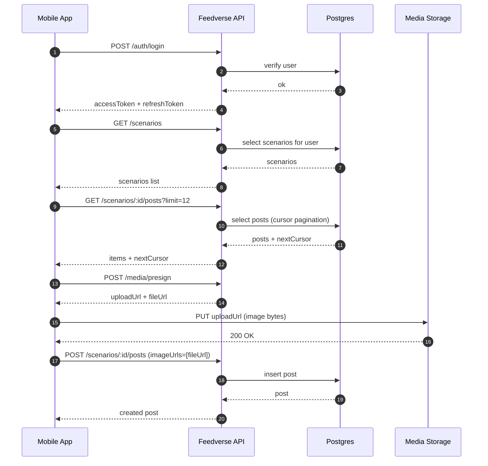
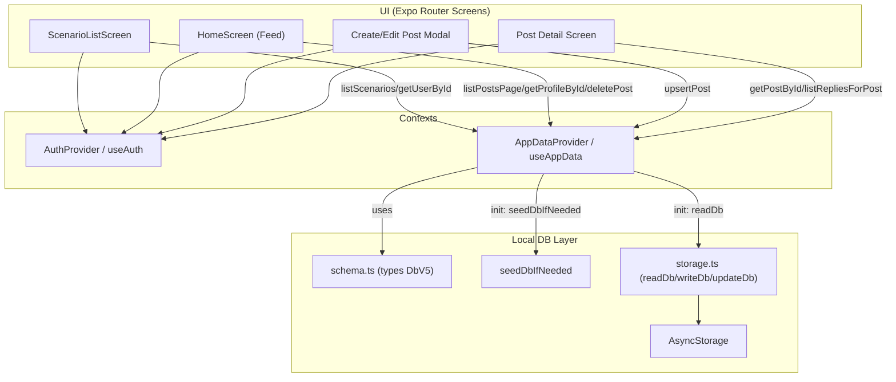
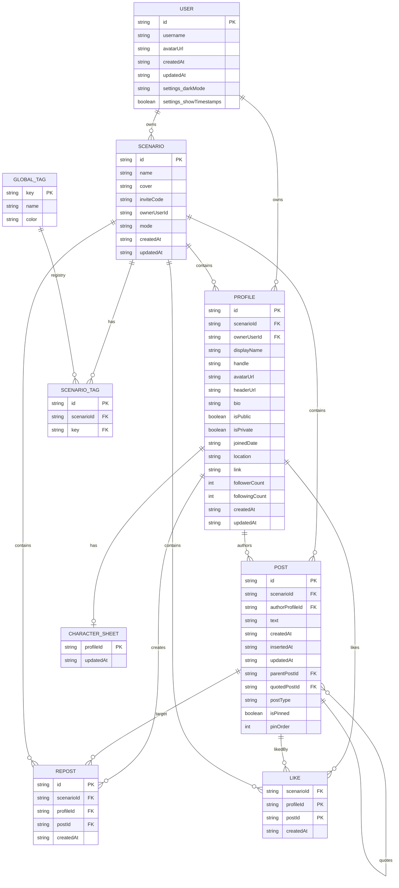
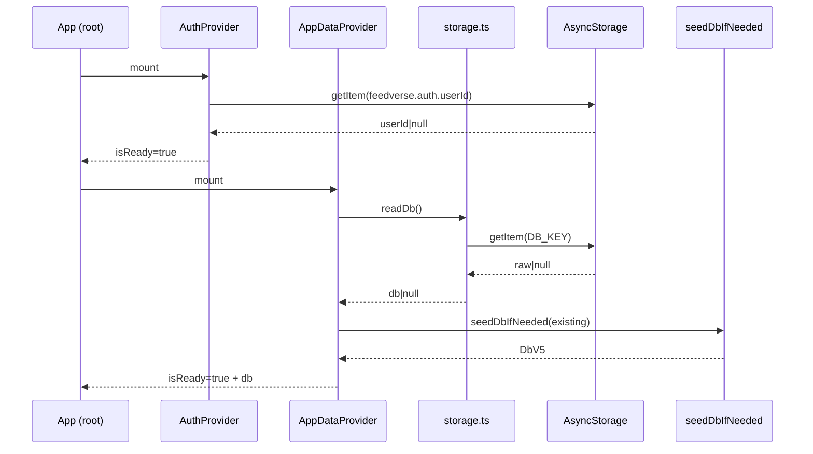
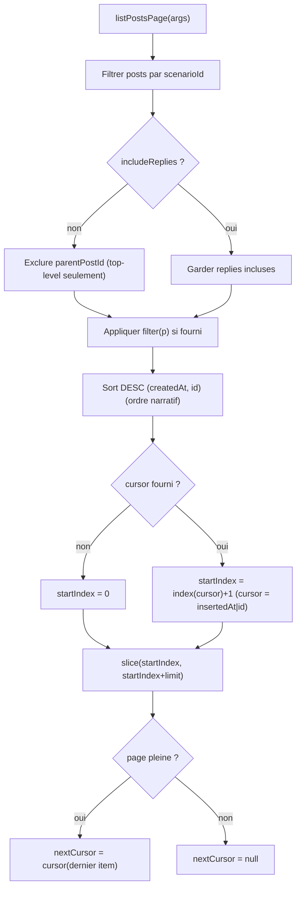
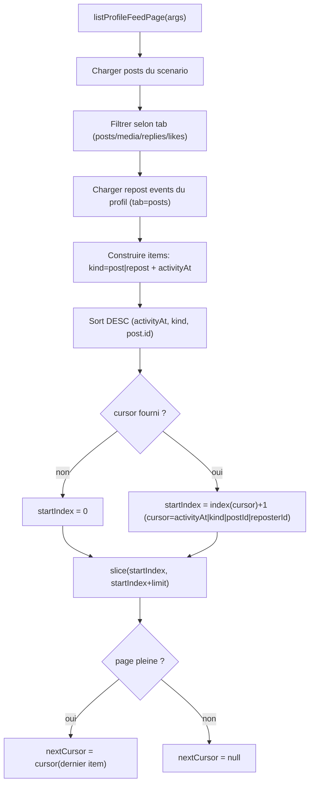

Documentation
** Mise à jours:** 04-01-2026

# 📘 Feedverse — Documentation Fonctionnelle
## 🎯 Objectif

🧩 **Feedverse est un moteur de narration.**  
Une application pour écrire des histoires, des fanfictions ou des campagnes de jeu de rôle **comme si elles se déroulaient en temps réel**, à travers plusieurs personnages.

---

## ✨ Description

Feedverse est une application de **création narrative** conçue pour les roleplayers, les auteurs et les créateurs d’univers.

Elle permet de raconter des histoires en incarnant **plusieurs personnages**, chacun avec sa propre identité, sa voix et sa place dans le récit.  
Les interactions entre personnages deviennent le cœur de la narration.

Au lieu de multiplier les outils — notes, documents, discussions séparées ou montages d’images — Feedverse centralise tout dans un **espace pensé pour écrire et jouer**.

Vous créez un **scénario** (un univers), puis autant de **profils de personnages** que nécessaire.  
Chaque profil peut publier, répondre, citer, et faire avancer l’histoire, seul ou à plusieurs.

Feedverse est idéal pour :
- écrire des fanfictions ou des AU,
- faire interagir plusieurs OCs dans un même univers,
- jouer des campagnes de jeu de rôle textuelles (comme du JDR ou du D&D asynchrone),
- construire des récits qui évoluent sur la durée, jour après jour.

L’application ne cherche pas à reproduire un réseau existant.  
Feedverse est un **outil créatif**, pensé comme un moteur de narration et un espace de jeu narratif.

---

## 🧠 Comment ça fonctionne

- 🗂️ **Scénarios séparés**  
  Chaque histoire possède son propre univers, indépendant des autres.

- 🎭 **Plusieurs profils par utilisateur**  
  Incarnez autant de personnages que nécessaire, sans contraintes techniques.

- ✍️ **Publications et interactions narratives**  
  Posts, réponses et citations servent à écrire des dialogues, des scènes et des événements.

- 🧩 **Gestion fluide de nombreux personnages**  
  Plus besoin de créer des faux screenshots ou des montages : tout est intégré.

- 👥 **Solo ou collaboratif**  
  Écrivez seul ou à plusieurs, selon vos projets narratifs.

---

# 🎨 À qui s’adresse Feedverse ?

- 🎭 Roleplayers (RP texte, univers partagés)
- 📝 Auteurs et créateurs d’OCs
- 🎲 Joueurs de JDR ou de D&D en version textuelle et asynchrone
- 👥 Groupes souhaitant écrire une histoire ensemble

---

# 🌱 En résumé

✨ Créez des univers  
🎭 Incarnez plusieurs personnages  
📖 Écrivez des récits vivants  
🎲 Jouez des histoires à plusieurs  
🧩 Tout dans un seul moteur de narration

---

**Feedverse — raconter des histoires autrement.**

# 📘 Feedverse — Système de Campagne

## 🎭 Concepts fondamentaux

### 🗂️ Scénario

Un **scénario** est un univers narratif indépendant.

Un scénario peut représenter :
- une histoire,
- une fanfiction,
- une campagne JDR,
- une session RP longue.

Chaque scénario possède :
- ses propres profils,
- ses propres posts,
- ses règles internes,
- son mode de fonctionnement.

---

### ⚙️ Mode de scénario

Lors de la création d’un scénario, un **mode** est sélectionné :

#### ✍️ Mode Narratif
- narration libre,
- posts classiques,
- RP collaboratif sans règles mécaniques.

#### 🎲 Mode Campagne (JDR)
Active des fonctionnalités supplémentaires :
- feuilles de personnage complètes,
- système de jets de dés,
- rôles (MJ),
- posts épinglés
- journaux de campagne,
- combat / quêtes / logs.

---

## 🎭 Profils (Personnages)

Un **profil** représente un personnage incarné dans le scénario.

### Types de profils

#### 👤 Profil Joueur
- appartient à un utilisateur,
- représente un personnage jouable,
- possède une feuille de personnage complète,
- peut poster, répondre, agir.

#### 🤖 Profil Partagé (NPC / Système)
- est crée par un utilisateur
- est utilisable par les autres joueurs et le MJ
- sert pour :
  - PNJ,
  - narrateur,
  - système,
  - annonces,
  - posts épinglés

---

### 🔐 Partage de profils

Un profil peut être :
- **privé** → utilisable uniquement par son owner,
- **partagé** → utilisable par les autres joueurs.

---

## 🎩 Rôle de Maître du Jeu (MJ)

### Attribution du rôle MJ
- le créateur est MJ par défaut,
- le MJ peut attribuer le rôle à d’autres joueurs.

### Capacités du MJ
- créer des posts épinglés,
- voir toutes les fiches,
- gérer jets, combats, quêtes.

---

## 🧾 Feuille de personnage

### Identité
- nom, race, classe, niveau
- alignement, background

### 📊 Statistiques
strength, dexterity, constitution, intelligence, wisdom, charisma

### ❤️ Combat
- PV, PV max, état

### 🎒 Inventaire
- objets, équipements, ressources

### ✨ Capacités & sorts
- sorts, capacités

### 📝 Notes
- privées (owner + MJ)
- publiques

---

## 📰 Types de posts

- ✍️ RP: narration, dialogues, actions de personnage
- 🎲 Roll: jet de dé, affichage automatique du résultat, lié à un personnage et à une stat
- 📜 Log: journal de campagne, résumé de session, évènements
- 🗺️ Quest: objectifs, quêtes en cours, progression
- ⚔️ Combat: actions de combat, tours, dégâts, états
- ⚙️ MJ: annonces, règles, posts épinglés, narration

Dans le mode "story", les posts ont le type RP par défaut.

---

## 🎲 Rolls

```json
{
  "type": "roll",               // savoir que c’est un post de jet
  "profileId": "pr_123",        // quel personnage a lancé le jet
  "stat": "dexterity",          // quelle caractéristique est utilisée
  "dice": "d20",                // type de dé
  "baseRoll": 14,               // résultat brut
  "modifier": 3,                // bonus/malus
  "total": 17,                  // total final
  "result": "success",          // interprétation
  "text": "Sneaking past the guards"
}
```

- d20 = succès critique
- d1 = échec critique
- interprétation laissée au MJ

---

## 💬 IC / OOC DMS

Deux espaces de message privés séparés :
- IC : narration
- OOC : discussion hors-jeu

---

## 📌 Posts épinglés (campagne)

- règles
- résumé
- quêtes

Posts épinglés, éditables par le MJ.


# 🛠️ Feedverse — Documentation technique

> Cette doc décrit une API **proposée** (backend) pour accompagner l’app Feedverse (React Native/Expo) qui, aujourd’hui, persiste en local via `AsyncStorage` (DB v5).  
> Objectif : rendre l’app **syncable**, multi-device, et préparer une vraie couche serveur (auth, média, pagination, modération, etc.).

---

## 1) Vue d’ensemble

### Stack cible (suggestion)
- **Mobile** : Expo / React Native
- **Backend** : Node.js + TypeScript + Express/Fastify (au choix)
- **DB** : PostgreSQL (ou Mongo, mais Postgres recommandé)
- **Stockage médias** : S3 compatible (S3, Cloudflare R2, Supabase Storage, etc.)
- **Auth** : JWT (Access + Refresh) ou session + cookies (selon choix)
- **Observabilité** : logs structurés + Sentry (mobile + API)

### Principes
- IDs en string
- **Pagination par cursor**
- Endpoints **REST** simples, prévisibles
- Validation (Zod/Valibot côté API)

---

## 2) Modèle de données (rappel / alignement DB v5)

### User
- `id`, `username`, `avatarUrl`, `createdAt`, `updatedAt?`, `settings?`
- `settings.showTimestamps?`
- `settings.darkMode?` : `'light' | 'dark' | 'system'`

### Scenario
- `id`, `name`, `cover`, `playerIds[]`
- `createdAt`, `updatedAt?`
- `inviteCode`, `ownerUserId`
- `description?`
- `mode`: `'story' | 'campaign'`
- `gmUserIds?`: liste d’IDs user ayant le rôle MJ
- `tags?`: `ScenarioTag[]`
- `settings?`: actuellement utilisé comme espace de settings extensibles
  - `profileLimitMode?`: `'per_owner' | 'per_scenario'`
  - `pinnedPostIds?`: `string[]` (ordre d’épinglage)

### ScenarioTag
- `id`, `key`, `name`, `color`

### Profile
- `id`, `scenarioId`, `ownerUserId`
- `displayName`, `handle`, `avatarUrl`, `headerUrl?`, `bio?`
- `isPublic?`, `isPrivate?`, `joinedDate?`, `location?`, `link?`
- `followerCount?`, `followingCount?`, `createdAt`, `updatedAt?`
- likes : via table `likes` (relation `profileId` ↔ `postId`) plutôt que `likedPostIds[]`

### Like
- `scenarioId`, `profileId`, `postId`, `createdAt`
- unicité : 1 like max par (profileId, postId)

### Post
- `id`, `scenarioId`, `authorProfileId`
- `text`
- `createdAt` (**narratif / affichage**) — peut être modifié
- `insertedAt` (**technique / création**) — fixé à la création (utilisé comme cursor local)
- `updatedAt?`
- `imageUrls?[]`, `replyCount?`, `repostCount?`, `likeCount?`
- `parentPostId?` (reply)
- `quotedPostId?` (quote)
- `postType?`: `'rp' | 'roll' | 'log' | 'quest' | 'combat' | 'gm'`
- `meta?`: payload libre (roll, quest state, combat turn, etc.)
- `isPinned?`, `pinOrder?` (miroir UI des pins)

### Conversation (DM)
- `id`, `scenarioId`
- `participantProfileIds[]` (profils participants)
- `title?`, `avatarUrl?` (utile surtout pour les groupes)
- `createdAt`, `updatedAt?`, `lastMessageAt?`

> Remarque (DB Postgres) : côté backend, les participants sont mieux modélisés via une table de jointure `conversation_participants(conversation_id, profile_id)` plutôt qu’un `uuid[]`, pour garder l’intégrité référentielle + des index efficaces.

### Message (DM)
- `id`, `scenarioId`, `conversationId`
- `senderProfileId`
- `text`
- `createdAt`, `updatedAt?`, `editedAt?`

### Repost
- `id` (clé `${profileId}|${postId}`), `scenarioId`, `profileId`, `postId`, `createdAt`

### GlobalTag
- `key` (canonique), `name` (label), `color` (déterministe)

### CharacterSheet
- `profileId`
- identité: `name?`, `race?`, `class?`, `level?`, `alignment?`, `background?`
- stats: `stats.{strength,dexterity,constitution,intelligence,wisdom,charisma}`
- combat: `hp.{current,max,temp?}`, `status?`
- inventaire: `inventory[]`, `equipment?[]`
- sorts/capacités: `spells?[]`, `abilities?[]`
- notes: `publicNotes?`, `privateNotes?`, `updatedAt?`

### DbV5 (container local)
- `version: 5`, `seededAt`
- `users`, `scenarios`, `profiles`, `posts`, `reposts`
- `likes` (table côté backend ; local v5 peut rester en dérivé/cache si besoin)
- `tags` (registry global), `sheets` (key = profileId)
- `selectedProfileByScenario: Record<scenarioId, profileId>`

---

## 3) Conventions API

### Base URL
- `https://api.feedverse.app/v1`

### Auth
- `Authorization: Bearer <access_token>`
- refresh via endpoint (ou cookie HTTP-only)

### Horodatage
- ISO 8601 (UTC) : `2025-12-27T10:15:30.000Z`

### Pagination (cursor)
- cursor = `"${insertedAt}|${id}"`
- Tri de pagination (stable) : `insertedAt DESC, id DESC`
- Propriétés :
  - `limit` (défaut 15)
  - `cursor` (start **after** cursor)

> 📝 **Note (backend proposé)** : `createdAt` est une date **narrative/affichée** et peut changer (retcon). Dans ce cas, l’app **refresh** le feed après édition pour refléter le nouvel ordre visuel. La pagination reste fiable car elle se base sur `insertedAt` (immuable).

> 🧠 **Note (implémentation locale actuelle)** : `listPostsPage()` trie actuellement par `createdAt DESC, id DESC` (ordre narratif), mais le cursor local est construit via `insertedAt|id` et sert à retrouver une position dans la liste. Si `createdAt` change, l’ordre et donc la pagination peuvent bouger → l’app s’appuie plutôt sur un refresh après certaines éditions.

### Réponses & erreurs (format)
```json
{
  "data": { },
  "meta": { },
  "error": null
}
```

Erreur :
```json
{
  "data": null,
  "meta": null,
  "error": {
    "code": "VALIDATION_ERROR",
    "message": "Invalid handle",
    "details": { "handle": "..." }
  }
}
```

Codes recommandés : `UNAUTHORIZED`, `FORBIDDEN`, `NOT_FOUND`, `CONFLICT`, `RATE_LIMITED`, `VALIDATION_ERROR`.

---

## 4) Endpoints proposés

### 4.1 Auth

#### POST `/auth/login`
Mock / futur login (email+password / oauth).  
**Body**
```json
{ "username": "winter", "password": "..." }
```
**200**
```json
{
  "data": {
    "accessToken": "...",
    "refreshToken": "...",
    "user": { "id": "u14", "username": "winter", "avatarUrl": "...", "createdAt": "..." }
  }
}
```

#### POST `/auth/refresh`
**Body**
```json
{ "refreshToken": "..." }
```

#### POST `/auth/logout`
Invalide le refresh token.

---

### 4.2 Users & Settings

#### GET `/users/me`
Retourne l’utilisateur connecté.

#### PATCH `/users/me`
Met à jour `username`, `avatarUrl` 

#### PATCH `/users/me/settings`
**Body**
```json
{ "showTimestamps": true, "darkMode": "system" }
```

#### GET `/users/:userId`
Public (si besoin), sinon protégé.

#### GET `/users`
Admin / dev.

---

### 4.3 Scenarios

#### GET `/scenarios`
Liste les scénarios disponibles à l’utilisateur (ou tous publics).

#### GET `/scenarios/:scenarioId`
Détails + players (optionnel via query).

#### POST `/scenarios`
Créer un scénario (owner = userId courant).
**Body**
```json
{ "name": "K-Pop Universe", "cover": "https://...", "playerIds": ["u14","u2"] }
```

#### PATCH `/scenarios/:scenarioId`
Édit.

#### DELETE `/scenarios/:scenarioId`
Delete.

---

### 4.4 Profiles

#### GET `/scenarios/:scenarioId/profiles`
Query :
- `ownerUserId` (filtre)
- `handle` (exact / lookup)
- `q` (search displayName/handle)
- `limit`, `cursor` (pour la pagination)

Ex :
- `GET /scenarios/sc_1/profiles?ownerUserId=u14`
- `GET /scenarios/sc_1/profiles?handle=jiniret` (@jiniret)

#### GET `/profiles/:profileId`

#### POST `/scenarios/:scenarioId/profiles`
Créer profil.
**Body**
```json
{
  "displayName": "Hyunjin",
  "handle": "jiniret",
  "avatarUrl": "https://...",
  "bio": "..."
}
```

#### PATCH `/profiles/:profileId`
Édit profil (owner only).

#### DELETE `/profiles/:profileId`
Delete.

---

### 4.5 Posts (feed, replies, quote)

#### GET `/scenarios/:scenarioId/posts`
Feed du scénario (par défaut **sans replies**).
Query :
- `limit` (défaut 15)
- `cursor`
- `includeReplies=false|true`
- `authorProfileId` (pour écran profil)
- `q` (search text)
- `parentPostId` (pour lister les replies d’un post)

Ex :
- Feed : `GET /scenarios/sc_1/posts?limit=12`
- Page 2 : `GET /scenarios/sc_1/posts?limit=12&cursor=2025-12-27T...Z|k1` *(cursor basé sur `insertedAt|id`)*
- Posts d’un profil : `GET /scenarios/sc_1/posts?authorProfileId=pr_kpop_jinnie`
- Replies : `GET /scenarios/sc_1/posts?parentPostId=k1&sort=asc`

**200**
```json
{
  "data": {
    "items": [ { "id":"k1", "scenarioId":"sc_1", "authorProfileId":"pr_...", "text":"...", "createdAt":"..." } ],
    "nextCursor": "2025-12-27T10:15:30.000Z|k1"
  }
}
```

> Note : pour les replies tu peux choisir tri ASC (comme ton code) via `sort=asc`.

#### GET `/posts/:postId`
Retourne un post + (optionnel) ses relations :
- `?include=replies` (première page)
- `?include=quoted` (post cité)

#### POST `/scenarios/:scenarioId/posts`
Créer un post.
**Body**
```json
{
  "authorProfileId": "pr_kpop_jinnie",
  "text": "hello world",
  "imageUrls": ["https://..."],
  "parentPostId": null,
  "quotedPostId": null
}
```

#### POST `/posts/:postId/replies`
Créer reply (alias du précédent).
**Body**
```json
{ "authorProfileId": "pr_x", "text": "reply", "imageUrls": [] }
```

#### PATCH `/posts/:postId`
Édit (autorisé si owner profile).
**Body**
```json
{ "text": "edited text", "imageUrls": ["https://..."] }
```

#### DELETE `/posts/:postId`
Supprime (et supprime replies ou re-parent selon politique).
- Policy recommandée : supprimer replies en cascade (comme ton `deletePost` local).

---

### 4.6 Likes / Reposts (optionnel)

#### POST `/posts/:postId/likes`
Like par profile.  
**Body**
```json
{ "profileId": "pr_..." }
```

#### DELETE `/posts/:postId/likes?profileId=pr_...`

> Modèle recommandé : table `likes(profile_id, post_id, scenario_id, created_at)` + PK `(profile_id, post_id)` (1 like max).

#### POST `/posts/:postId/reposts`
#### DELETE `/posts/:postId/reposts?profileId=pr_...`

> Tu peux aussi modéliser `Like` et `Repost` comme tables/collections.

---

### 4.7 Media Upload (images)

#### POST `/media/presign`
Retourne une URL de upload (S3 presigned).
**Body**
```json
{ "contentType": "image/jpeg", "fileName": "post_123.jpg" }
```
**200**
```json
{
  "data": {
    "uploadUrl": "https://...",
    "fileUrl": "https://cdn....../post_123.jpg"
  }
}
```

Workflow recommandé :
1) Mobile demande `presign`
2) Mobile upload direct vers storage
3) Mobile poste `fileUrl` dans `imageUrls[]`

---

### 4.8 Sélection de profil (selectedProfileByScenario)

Tu as `selectedProfileByScenario: Record<scenarioId, profileId>` dans la DB locale.

#### GET `/scenarios/:scenarioId/selection`
**200**
```json
{ "data": { "selectedProfileId": "pr_..." } }
```

#### PUT `/scenarios/:scenarioId/selection`
**Body**
```json
{ "selectedProfileId": "pr_..." }
```

---

### 4.9 DMs (Conversations + Messages)

Objectif : supporter des DMs **IC** / **OOC** sans casser l’UX existante.

#### GET `/scenarios/:scenarioId/conversations`
Liste l’inbox (conversations où le profil participe).

Query :
- `profileId` (profil “acteur”)
- `limit`, `cursor` (optionnel)

#### POST `/scenarios/:scenarioId/conversations`
Crée une conversation (DM 1:1 ou groupe).

**Body**
```json
{
  "participantProfileIds": ["pr_a", "pr_b"],
  "title": null,
  "avatarUrl": null
}
```

#### GET `/conversations/:conversationId/messages`
Liste les messages d’un thread.

Query :
- `limit`, `cursor` (optionnel)
- `sort=asc|desc` (par défaut `asc` pour une UI “chat”)

#### POST `/conversations/:conversationId/messages`
Envoie un message.

**Body**
```json
{ "senderProfileId": "pr_a", "text": "hello" }
```

#### PATCH `/messages/:messageId`
Édite un message (owner du `senderProfileId` uniquement).

**Body**
```json
{ "text": "edited" }
```

#### DELETE `/messages/:messageId`
Supprime un message.

> Politique (recommandation) : hard delete en V1 (simple). Plus tard : soft delete (`deleted_at`, `deleted_by_profile_id`) si besoin.

---

## 5) Permissions (alignement avec `canEditPost`)

### Règle proposée
- Un post est éditable/supprimable si :
  - user connecté == owner du `authorProfileId`
  - OU user a un rôle admin/mod sur le scenario (future)

Même logique pour `Profile` :
- owner seulement (ou admin/mod)

---

## 6) Index & perf (Postgres)

### Index recommandés
- `posts (scenario_id, created_at desc, id desc)` *tri narratif*
- `posts (scenario_id, inserted_at desc, id desc)` *pagination stable*
- `posts (parent_post_id, created_at asc, id asc)` *pour replies*
- `profiles (scenario_id, lower(handle)) unique`
- `profiles (scenario_id, owner_user_id)`
- `scenarios_players (scenario_id, user_id)` si table de jointure

### Dénormalisation légère
- `replyCount`, `likeCount`, `repostCount` sur `posts`
- recalcul via triggers / jobs / transaction (au choix)

---

## 7) Synchronisation local ↔ serveur (migration douce)

### Phase 1 (actuel)
- Local only : `AsyncStorage` DB v3 + seed

### Phase 2 (hybride)
- Read : serveur si online, fallback local
- Write : optimistic local + sync queue (retry)

### Phase 3
- Serveur source of truth
- Local cache + offline mode

> Très compatible avec ta pagination cursor actuelle.

---

## 8) Exemples rapides (curl)

### Feed (page 1)
```bash
curl -H "Authorization: Bearer $TOKEN" \
  "https://api.feedverse.app/v1/scenarios/sc_1/posts?limit=12"
```

### Feed (page 2)
```bash
curl -H "Authorization: Bearer $TOKEN" \
  "https://api.feedverse.app/v1/scenarios/sc_1/posts?limit=12&cursor=2025-12-27T10:15:30.000Z|k1"
```

### Créer un post
```bash
curl -X POST -H "Authorization: Bearer $TOKEN" -H "Content-Type: application/json" \
  -d '{"authorProfileId":"pr_kpop_jinnie","text":"hello","imageUrls":[]}' \
  "https://api.feedverse.app/v1/scenarios/sc_1/posts"
```

### Inbox (DM)
```bash
curl -H "Authorization: Bearer $TOKEN" \
  "https://api.feedverse.app/v1/scenarios/sc_1/conversations?profileId=pr_kpop_jinnie"
```

### Thread messages (DM)
```bash
curl -H "Authorization: Bearer $TOKEN" \
  "https://api.feedverse.app/v1/conversations/cv_1/messages?sort=asc&limit=50"
```

### Envoyer un message (DM)
```bash
curl -X POST -H "Authorization: Bearer $TOKEN" -H "Content-Type: application/json" \
  -d '{"senderProfileId":"pr_kpop_jinnie","text":"hello"}' \
  "https://api.feedverse.app/v1/conversations/cv_1/messages"
```

---

## 9) Mermaid — flux API (résumé)



---

## 10) TODO V2 (pour aller plus loin)
- endpoint **search** multi-entités (posts/profiles)
- modération : report/block/mute
- mentions `@handle`, hashtags
- notifications (reply/like/repost)
- webhooks / export scenario


# 🏛️ Feedverse — Documentation d’architecture

> **Contexte** : application React Native (Expo) orientée “social simulation / multi-profils”, avec persistance locale via `AsyncStorage`.
> Cette doc décrit l’architecture actuelle basée sur tes fichiers : `schema.ts`, `storage.ts`, `AuthProvider`, `AppDataProvider`, `HomeScreen`, `ScenarioListScreen`.

---

## 1) Vue d’ensemble

### Objectifs
- **Source de vérité locale** : un objet `DbV5` persiste dans `AsyncStorage` (clé `feedverse.db.v1`).
- **Accès aux données via Context** : `AppDataProvider` expose des *selectors* + *actions* (CRUD).
- **Authentification mock** : `AuthProvider` gère `userId` (stocké séparément).
- **Navigation Expo Router** : parcours par scenario (`/(scenario)/:scenarioId`) + modals (create/edit post) + détail post.

---

## 2) Modules et responsabilités

### `mobile/data/db/schema.ts`
- Déclare les types : `User`, `UserSettings`, `Scenario`, `ScenarioTag`, `Profile`, `Post`, `Repost`, `GlobalTag`, `CharacterSheet`, `DbV5`.
- `DbV5` contient :
  - `users`, `scenarios`, `profiles`, `posts`, `reposts` en `Record<string, T>`
  - `tags: Record<string, GlobalTag>` (registry global de tags)
  - `sheets: Record<string, CharacterSheet>` (key = profileId)
  - `selectedProfileByScenario: Record<scenarioId, profileId>` (profil actif par scenario)
  - métadonnées `version`, `seededAt`

### `mobile/data/db/storage.ts`
- Abstraction persistance `AsyncStorage` :
  - `readDb()` : lit + parse JSON
  - `writeDb(db)` : écrit JSON
  - `updateDb(fn)` : read → transform → write, retourne le nouveau db

### `mobile/context/auth.tsx`
- Auth “mock” :
  - persiste `feedverse.auth.userId`
  - `signInMock()` fixe `DEV_USER_ID` (ex: `u14`)
  - `signOut()` supprime la clé

### `mobile/context/appData.tsx` (ton provider)
- Chargement initial :
  - `readDb()` → `seedDbIfNeeded(existing)` → `setState({isReady:true, db})`
- **Selectors** :
  - Scenarios: `getScenarioById`, `listScenarios`
  - Profiles: `getProfileById`, `getProfileByHandle`, `listProfilesForScenario`
  - Posts: `getPostById`, `listPostsForScenario`, `listRepliesForPost`
  - Pagination: `listPostsPage({scenarioId, limit, cursor, filter, includeReplies})`
  - Profile feed: `listProfileFeedPage({scenarioId, profileId, tab, limit, cursor})` (posts + reposts)
  - Selection: `getSelectedProfileId`
- **Actions** :
  - `setSelectedProfileId`
  - `upsertProfile`
  - `deleteProfileCascade` (supprime profile + posts/likes/reposts liés + nettoie pins/likes/sheet/selection)
  - `upsertPost`
  - `deletePost` (supprime le post, retire les reposts pointant dessus, et le retire des pins)
  - Likes: `toggleLike`, `isPostLikedBySelectedProfile`
  - Reposts: `toggleRepost`, `isPostRepostedBySelectedProfile`
  - Pins: `togglePinPost`, `listPinnedPostsForScenario`, `reorderPinnedPostsForScenario`
  - Sheets: `getCharacterSheetByProfileId`, `upsertCharacterSheet`
  - GM: `gmApplySheetUpdate` (patch sheets + crée un post GM de résumé)
  - Scenarios avancé: join par `inviteCode`, `leaveScenario`, `transferScenarioOwnership`, `transferProfilesToUser`, `adoptPublicProfile`
  - Import/Export: preview/import/export d’un scénario (profiles/posts/reposts/sheets)

### Écrans (UI)
- `ScenarioListScreen` :
  - liste les scenarios, affiche avatars des `players` (depuis `User`)
  - actions header : settings (placeholder), logout
- `HomeScreen` :
  - feed paginé (`listPostsPage`)
  - `SwipeableRow` si `canEditPost` vrai
  - navigation : create/edit post, post detail
  - “refresh” simplifié après delete → `loadFirstPage()`

---

## 3) Mermaid — Composants & dépendances



---

## 4) Mermaid — Modèle de données (ERD)

> Note : Mermaid ERD ne supporte pas parfaitement les `Record<>` ni les arrays, on les modélise comme relations logiques.



---

## 5) Mermaid — Séquence de démarrage (boot)



---

## 6) Mermaid — Pagination du feed (listPostsPage)



---

## 6.1) Mermaid — Pagination feed profil (listProfileFeedPage)

`listProfileFeedPage` construit un flux par profil, mélangeant **posts** et **reposts** triés par `activityAt`.



---

## 7) Comportements clés et règles

### Posts & Replies
- Un post est une reply si `parentPostId` est défini.
- Le feed “Home” liste par défaut **seulement les top-level posts** (`!parentPostId`).
- Les replies sont récupérées via `listRepliesForPost(postId)` et triées en **ASC** (`createdAt`, `id`).

### Stabilité de tri
- Les tris utilisent `localeCompare` sur `createdAt` (ISO string) + `id`.
- Ça assure un ordre stable même si des posts ont le même timestamp.
- **Cursor local** : construit sur `insertedAt|id`.
- **Affichage narratif** : re-trier sur `createdAt` après un refresh (si cette date à été modifiée).

### Suppression
- `deletePost(postId)` supprime :
  - le post ciblé
  - tous les repost events qui pointent vers ce post
  - tous les likes pointant vers ce post
  - la référence dans `scenario.settings.pinnedPostIds` si le post était épinglé

- `deleteProfileCascade(scenarioId, profileId)` supprime :
  - le profile
  - tous les posts dont il est l’auteur
  - ses likes (table `likes`) + décrémente les `likeCount` des posts concernés
  - ses reposts + décrémente `repostCount`
  - sa fiche (`sheets[profileId]`)
  - nettoie les pins + la sélection active si nécessaire

---

## 8) Contraintes & points d’attention

### 8.1 DB en mémoire vs AsyncStorage
- Le provider maintient `db` en state React.
- Toute mutation passe par `updateDb(fn)` puis `setState` avec le résultat.
- ⚠️ Si d’autres parties de l’app écrivent dans AsyncStorage sans passer par `AppDataProvider`, tu peux avoir des incohérences UI (state vs storage).

### 8.2 Pagination “cursor” 
- Le cursor est basé sur `insertedAt|id` (**stable**).
- `createdAt` est une date **narrative/affichée** et peut être modifiée (retcon).
- Après une édition qui change `createdAt`, l’app **refresh** le feed pour refléter le nouvel ordre visuel.

### 8.3 Sélection du profil actif
- `selectedProfileByScenario[scenarioId]` est la clé centrale pour savoir “qui poste / agit”.
- Pense à fallback (si supprimé) : choisir le premier profile du user dans le scenario, etc. (si tu ajoutes cette logique plus tard).

---

## 9) Extensions recommandées (architecture)

### 9.1 Split “selectors” / “commands”
- Garder `AppDataApi` mais séparer :
  - `selectors.*` (pure, sync)
  - `commands.*` (async, persiste)
- Avantage : testabilité + lisibilité.

### 9.2 Indexs dérivés en mémoire (perf)
Pour des gros scénarios :
- `profilesByScenarioId`
- `postsByScenarioId` triés
- `repliesByParentId`
- Rebuild à chaque update (ou memo) pour éviter des `Object.values().filter().sort()` trop fréquents.

---
